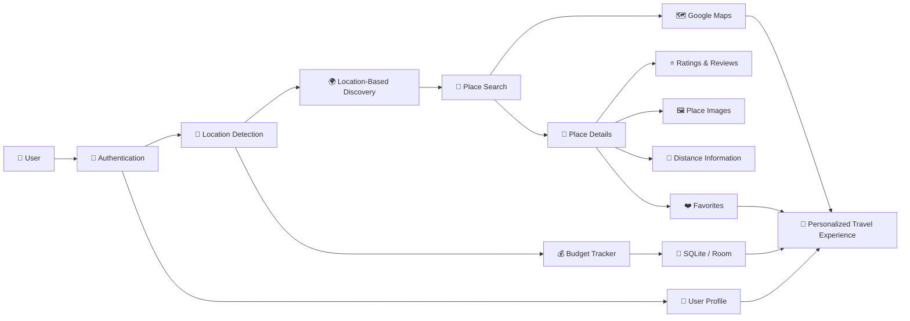
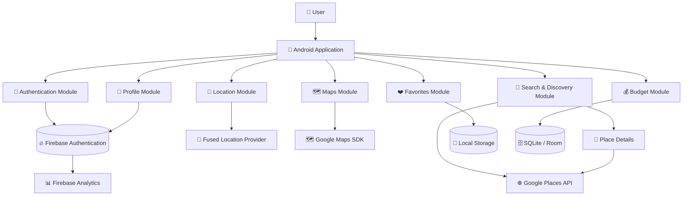
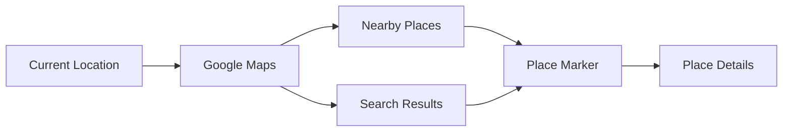
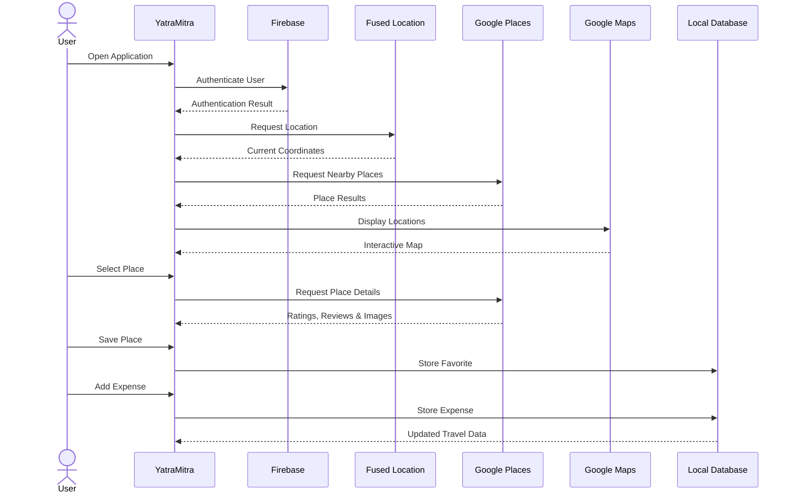

# 🌍 YatraMitra

### Smart, Location-Aware Travel Companion for Android

<p align="center">
  <strong>An intelligent Android travel companion for location-based discovery, interactive maps, personalized place search, favorites, and travel expense management.</strong>
</p>

<p align="center">


</p>

---

## 📌 About the Project

**YatraMitra** is a smart Android-based travel companion designed to simplify **travel discovery, local exploration, destination search, and expense management** through a unified mobile platform.

Travelers often depend on multiple applications to discover nearby destinations, search for restaurants and hotels, view locations on maps, save interesting places, and manage their travel expenses.

YatraMitra brings these essential travel utilities together by combining:

* 📍 Location-Based Discovery
* 🗺️ Interactive Maps
* 🔎 Intelligent Place Search
* ⭐ Place Ratings & Reviews
* ❤️ Favorite Destinations
* 💰 Travel Expense Management
* 🔐 Firebase Authentication
* 👤 Personalized User Experience
* 💾 Offline Expense Storage

into a single Android application.

---

# 🎯 Problem Statement

Travel planning and local exploration often require users to switch between multiple applications.

Common challenges include:

* Finding relevant destinations near the current location
* Searching for restaurants, hotels, and attractions
* Comparing place information and ratings
* Understanding the distance from a destination
* Saving interesting places for later
* Managing travel expenses separately
* Maintaining personalized travel information
* Accessing essential expense data when internet connectivity is limited

The absence of these utilities in a unified platform can make the travel experience fragmented and less convenient.

### YatraMitra addresses these challenges through an integrated, location-aware travel platform.

---

# 💡 Proposed Solution

YatraMitra combines **Android location services, Google Maps, Google Places, Firebase, and local database technologies** to create a personalized travel experience.

The application follows a location-aware discovery pipeline:



---

# 🏗️ System Architecture

The application is organized into modular components where each service performs a dedicated responsibility.



---

# 🚀 Core Features

## 🔐 1. User Authentication

The authentication module provides a secure and personalized entry point into the application.

### Features

* Firebase Authentication
* Email-based OTP verification
* Secure session management
* Personalized user accounts
* Authentication-aware application flow

---

## 📍 2. Location-Based Discovery

YatraMitra uses the **Fused Location Provider** to determine the user's current location and provide relevant nearby destinations.

Users can discover:

* 🏛️ Tourist attractions
* 🍽️ Restaurants
* 🏨 Hotels
* 📌 Points of interest
* 🌆 Local destinations

The location-aware approach allows users to explore places based on their current geographical context.

---

## 🔎 3. Place Search & Discovery

The application integrates the **Google Places API** to support keyword-based destination discovery.

Users can search for places such as:

```text
Restaurants
Hotels
Tourist Attractions
Cafes
Shopping Areas
Nearby Places
Other Points of Interest
```

Search results can be explored through both list-based and map-based interfaces.

---

## 📌 4. Detailed Place Information

After selecting a destination, users can access relevant information about the location.

### Place information includes:

* ⭐ Ratings
* 💬 Reviews
* 📏 Distance
* 🖼️ Place images
* 📍 Location information
* ℹ️ Additional place details

This helps users make more informed decisions while exploring destinations.

---

# 🗺️ 5. Interactive Maps

YatraMitra integrates the **Google Maps SDK for Android** to provide an interactive geographical interface.



### Map capabilities

* 📍 Current location visualization
* 📌 Place markers
* 🔎 Search-based locations
* 🗺️ Interactive map exploration
* 📏 Location-aware discovery

---

# ❤️ 6. Favorites & Saved Places

Users can save destinations that they may want to revisit later.

### Favorites provide:

* ❤️ Save preferred destinations
* 📌 Quick access to saved places
* 🗂️ Personalized destination collection
* 🔄 Easy revisit of previously discovered locations

---

# 💰 7. Travel Budget Management

YatraMitra includes a dedicated **travel expense management module**.

Users can:

* ➕ Add expenses
* 🏷️ Categorize expenses
* 💵 Track total spending
* 📊 Monitor travel costs
* ✏️ Manage existing expenses
* 🗑️ Remove unnecessary entries

Expense information can be stored locally using **SQLite / Room**, supporting offline access to essential budget data.

---

# 👤 8. Personalized User Profile

The profile module provides users with a personalized application experience.

### Includes

* 👤 User information
* 🔐 Authentication state
* ❤️ Saved destinations
* 💰 Travel-related information
* ⚙️ Session management

---

# 🔄 Application Workflow

The complete user journey can be represented as:



---

# 🧩 System Modules

```text
YatraMitra
│
├── 📱 Android Application
│
├── 🔐 Authentication
│   ├── Firebase Authentication
│   ├── Email OTP
│   └── Session Management
│
├── 📍 Location Services
│   └── Fused Location Provider
│
├── 🔎 Place Discovery
│   ├── Google Places API
│   ├── Keyword Search
│   └── Nearby Search
│
├── 🗺️ Maps
│   └── Google Maps SDK
│
├── 📌 Place Details
│   ├── Ratings
│   ├── Reviews
│   ├── Distance
│   └── Images
│
├── ❤️ Favorites
│   └── Saved Places
│
├── 💰 Budget Tracker
│   ├── Add Expense
│   ├── Expense Categories
│   ├── Total Spending
│   └── Local Storage
│
├── 👤 User Profile
│   ├── User Information
│   └── Personalized Experience
│
└── 📊 Analytics
    └── Firebase Analytics
```

---

# 🛠️ Technology Stack

| Layer                    | Technology                  |
| ------------------------ | --------------------------- |
| **Programming Language** | Java                        |
| **Platform**             | Android                     |
| **UI & Components**      | Android Jetpack             |
| **Authentication**       | Firebase Authentication     |
| **Analytics**            | Firebase Analytics          |
| **Location Services**    | Fused Location Provider     |
| **Maps**                 | Google Maps SDK for Android |
| **Place Discovery**      | Google Places API           |
| **Networking**           | OkHttp                      |
| **JSON Processing**      | Gson                        |
| **Image Loading**        | Glide                       |
| **Local Storage**        | SQLite / Room               |
| **Email Service**        | SendGrid API                |
| **Build System**         | Gradle                      |

---

# 📊 Feature-to-Technology Mapping

| Application Feature   | Technology                  |
| --------------------- | --------------------------- |
| User Authentication   | Firebase Authentication     |
| OTP Verification      | Firebase / Email Service    |
| Current Location      | Fused Location Provider     |
| Nearby Discovery      | Google Places API           |
| Place Search          | Google Places API           |
| Maps                  | Google Maps SDK             |
| Ratings & Reviews     | Google Places               |
| Place Images          | Google Places + Glide       |
| Favorites             | Local / Application Storage |
| Expense Management    | SQLite / Room               |
| API Communication     | OkHttp                      |
| JSON Handling         | Gson                        |
| Application Analytics | Firebase Analytics          |
| Android Build         | Gradle                      |

---

# 🌟 Key Highlights

### 📍 Location Intelligence

Provides context-aware discovery based on the user's geographical location.

### 🗺️ Visual Exploration

Combines place discovery with interactive Google Maps for a more intuitive experience.

### ❤️ Personalization

Allows users to maintain their own collection of favorite destinations.

### 💰 Integrated Expense Management

Brings travel budget tracking directly into the travel discovery experience.

### 📱 Unified Travel Experience

Reduces the need to switch between separate applications for common travel activities.

### 💾 Offline-Friendly Storage

Uses local database technologies for storing essential expense and application data.

---

# 🔮 Future Enhancements

The platform can be extended with advanced travel intelligence and personalization features.

### 🤖 AI-Powered Recommendations

Recommend destinations based on user interests, search history, and travel preferences.

### 🧭 Smart Trip Planner

Generate multi-day itineraries based on destination, available time, budget, and interests.

### 🌦️ Weather-Aware Recommendations

Provide travel suggestions based on current and forecasted weather conditions.

### 📊 Advanced Expense Analytics

Introduce charts, spending trends, category analysis, and budget alerts.

### 👥 Social Travel

Allow users to share destinations, itineraries, and travel experiences.

### 🔔 Smart Notifications

Provide contextual reminders and destination-based notifications.

### 🌐 Multi-Language Support

Support multiple Indian and international languages for broader accessibility.

### 📴 Enhanced Offline Mode

Provide cached destination information and improved offline travel utilities.

---

# 🎯 Project Objectives

The primary objectives of YatraMitra are to:

* Develop a **location-aware Android travel application**
* Simplify local destination discovery
* Integrate map-based geographical exploration
* Provide detailed destination information
* Enable personalized favorite management
* Integrate travel expense tracking
* Demonstrate real-world use of Android APIs and cloud services
* Create a unified and user-friendly travel experience

---

# 🏁 Conclusion

**YatraMitra** combines location intelligence, digital maps, place discovery, personalization, and travel expense management into a single Android platform.

By integrating **Google Maps, Google Places, Firebase, Fused Location Provider, and local storage technologies**, the application provides users with a centralized solution for discovering destinations and managing essential aspects of their journey.

> ### 🌍 **YatraMitra**
>
> **Discover New Places. Plan Your Journey. Track Your Expenses.**
>
> **Your Journey. Your Places. Your Budget. Your Companion.**
